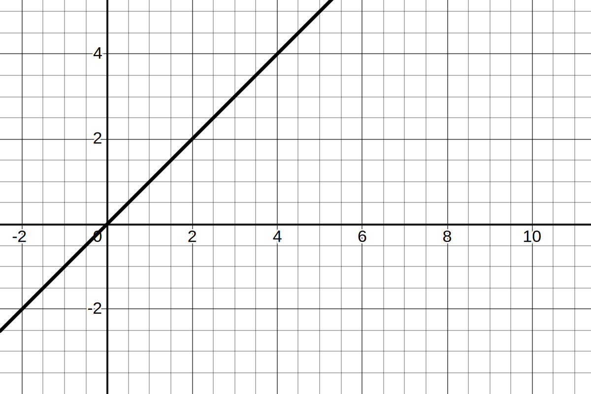
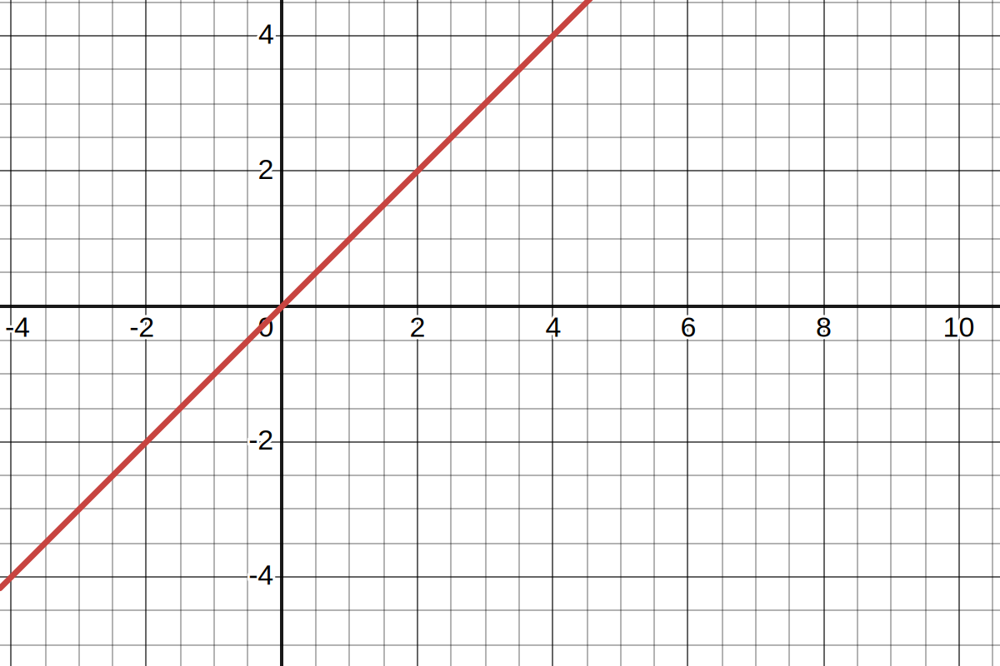
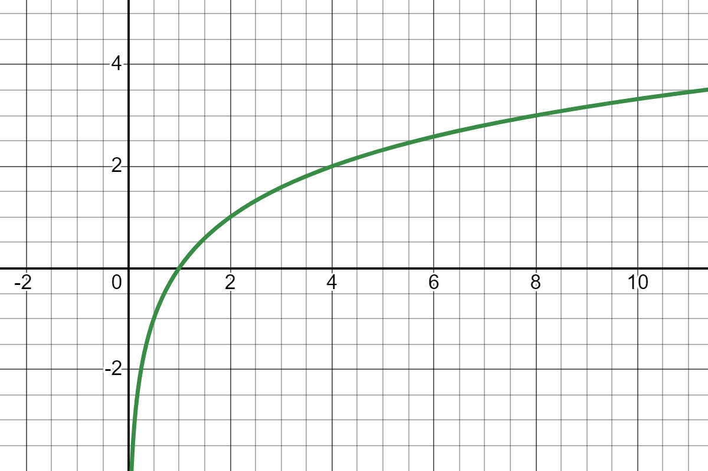

# Atividade B3-3

## Análise da Complexidade de Tempo

Em todos os algoritmos, o pior caso se trata daquele em que o número procurado não se encontra no array, o que implica no máximo número de repetições dos laços além de verificações extras para então retornar -1, explicitando que o número não foi encontrado.

***OBS:*** *As funções próprias de bibliotecas do C usadas no código, neste caso `printf` e `floor`, são consideradas desprezíveis para notação Big O, portanto, como não consegui achar os devidos códigos fontes destas funções assumirei que elas são equivalentes a 1t, só para caso de estudo.*

### Busca Linear

*Código localizado em* `./Códigos/BuscaLinear`

A complexidade da busca linear (somente a função `linear_search`) é:
**`4tn + 3t`**.

Somando essa complexidade com o resto do código(função main()), obtemos a complexidade de **`4tn + 6t`**.

### Busca Linear em Ordem

*Código localizado em* `./Códigos/BuscaLinearEmOrdem`

A complexidade da busca linear em ordem (somente a função `ordered_linear_search`) é: **`7tn + 6t`**

Somando essa complexidade com o resto do código(função main()), obtemos a complexidade de **`7tn + 9t`**.

### Busca Binária

*Código localizado em* `./Códigos/BuscaBinaria`

Para este algoritmo, é importante notar que o laço de repetição já não depende exatamente do tamanho do array(n), mas sim em quantas vezes esse array pode ser particionado em duas partes. Dessa forma, tomamos como parâmetro, para determinar a complexidade do algoritmo, **log₂(n)**.

A complexidade da busca binária (somente a função `binary_search`) é: **`11t(log₂(n)) + 5t`**

Somando essa complexidade com o resto do código(função main()), obtemos a complexidade de **`11t(log₂(n)) + 8t`**.

## Notação Big O

Para realizar esta análise, são, primeiramente, descartadas as constantes e a função é reduzida somente a expressão de maior complexidade do algoritmo, ou seja, é feita uma análise assintótica do algoritmo. Após isso, para se tornar uma notação Big O, é somente considerado o pior caso possível do algoritmo.

### Busca Linear

A expressão **`4tn + 6t`** é reduzida a **`O(n)`**

### Busca Linear em Ordem

A expressão **`7tn + 9t`** é reduzida a **`O(n)`**

### Busca Binária

A expressão **`11t(log₂(n)) + 8t`** é reduzida a **`O(log₂(n))`**

## Gráfico

Nesta seção, as notações Big O dos algoritmos serão passados como funções para um gráfico, para que haja uma visualização da complexidade de tempo

### Busca Linear `O(n)`

### Busca Linear em Ordem `O(n)`

### Busca Binária `O(log₂(n))`

